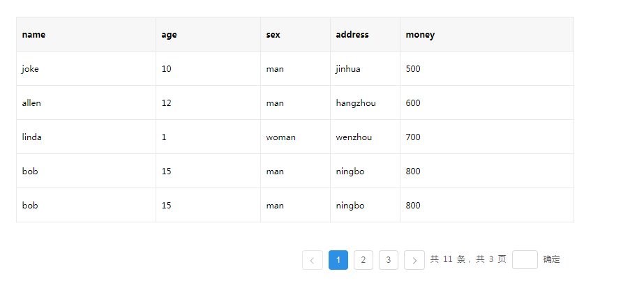
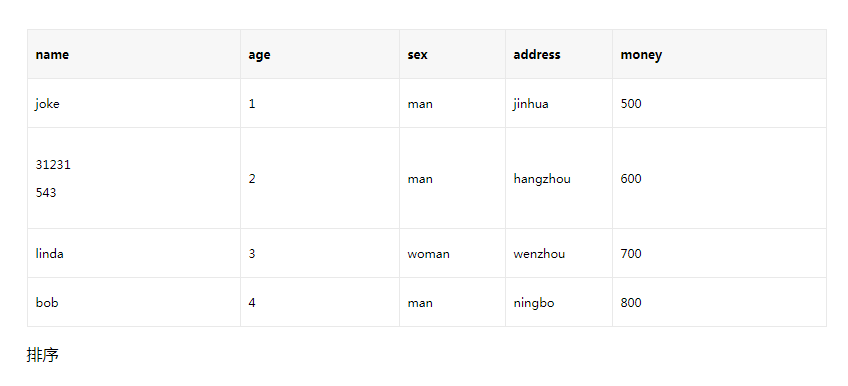
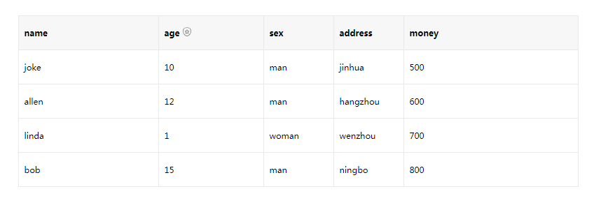

### 表格 / Table

#### 使用
```js
//使用方法到containers文件夹中看
//也可clone代码直接启动看效果

import React, { Component } from 'react'
import Table from '../components/Table/Table'
import './common.css'

let dataSource = [
    {
    name: 'joke',
    age: '10',
    sex: 'man',
    address: 'jinhua',
    wallet: {
        money: 500
    }
    },
    {
    name: 'allen',
    age: '12',
    sex: 'man',
    address: 'hangzhou',
    wallet: {
        money: 600
    }
    },
    {
    name: 'linda',
    age: '1',
    sex: 'woman',
    address: 'wenzhou',
    wallet: {
        money: 700
    }
    },
    {
    name: 'bob',
    age: '15',
    sex: 'man',
    address: 'ningbo',
    wallet: {
        money: 800
    }
    }
]

export default class common extends Component {
    constructor () {
        super()

        this.state = {
            dataSource,
            page: 1
        }
    }

    delete = (index) => {
        const me = this
        let arr = me.state.dataSource
        arr.splice(index, 1)
        console.log(arr)
        me.setState(
            {
                dataSource: arr
            }
        )
    }

    render () {
        const me = this
        let columns = [
            {
            title: 'name',
            dataIndex: 'name',
            key: 'name',
            width: '200px',
            render (data, record, index) {
                return data
            }
            },
            {
            title: 'age',
            dataIndex: 'age',
            key: 'age',
            width: '150px',
            render (data, record, index) {
                return data
            }
            },
            {
            title: 'sex',
            dataIndex: 'sex',
            key: 'sex',
            width: '100px',
            render (data, record, index) {
                return data
            }
            },
            {
            title: 'address',
            dataIndex: 'address',
            key: 'address',
            width: '500px',
            render (data, record, index) {
                return data
            },
            thStyle: {
                borderColor: 'red'
            },
            tdStyle: {
                borderColor: 'green'
            }
            },
            {
            title: 'money',
            dataIndex: 'wallet.money',
            key: 'money',
            width: '500px',
            render (data, record, index) {
                return <span data-index="index" onClick={me.delete.bind(null, index)}>删除</span>
            }
            }
        ]

        return (
            <div style={{width: '800px', margin: '100px auto', height: '300px'}}>
                <Table 
                    bordered={true}
                    columns={columns}
                    dataSource={this.state.dataSource}
                    loading={true}
                    onRowMouseEnter={function (data, index) {console.log(data, index)}}
                    onRowMouseLeave={function (data, index) {console.log(data, index)}}
                    onLeftOneClick={function (data, index) {console.log(data, index)}}
                />
            </div>
        )
    }
}

```

#### 效果图

### 常规图



### 排序图



### 筛选图




#### API

<table>
  <tr>
    <th>参数</th>
    <th>说明</th>
    <th>类型</th>
    <th>默认值</th>
  </tr>
  <tr>
    <td>className</td>
    <td>组件最外层的class</td>
    <td>string</td>
    <td>-</td>
  </tr>
  <tr>
    <td>bordered</td>
    <td>是否显示边框</td>
    <td>bollean</td>
    <td>false</td>
  </tr>
  <tr>
    <td>columns</td>
    <td>表格列的配置描述，具体项见下表</td>
    <td>array</td>
    <td>-</td>
  </tr>
  <tr>
    <td>dataSource</td>
    <td>数据数组</td>
    <td>array</td>
    <td>-</td>
  </tr>
  <tr>
    <td>header</td>
    <td>表格头部</td>
    <td>reactnode|string</td>
    <td>-</td>
  </tr>
  <tr>
    <td>footer</td>
    <td>表格底部</td>
    <td>reactnode|string</td>
    <td>-</td>
  </tr>
  <tr>
    <td>pagination</td>
    <td>表格对应页 未填则不显示 若需要则根据pagination组件所需参数配置 当允许拖拽时 不允许使用分页</td>
    <td>object</td>
    <td>-</td>
  </tr>
  <tr>
    <td>loading</td>
    <td>是否显示loading图标</td>
    <td>boolean</td>
    <td>true</td>
  </tr>
  <tr>
    <td>scroll</td>
    <td>是否显示scroll 例{x: '1000px', y: '500px'}</td>
    <td>object</td>
    <td>-</td>
  </tr>
  <tr>
    <td>onRowMouseEnter</td>
    <td>行mouseEnter函数 参数：data（当前行数据）, index（当前行index）, e（当前行e）</td>
    <td>Function (data, index, e)</td>
    <td>noop</td>
  </tr>
  <tr>
    <td>onRowMouseLeave</td>
    <td>行mouseLeave函数 参数：data（当前行数据）, index（当前行index）, e（当前行e）</td>
    <td>Function (data, index, e)</td>
    <td>noop</td>
  </tr>
  <tr>
    <td>onLeftOneClick</td>
    <td>行左鼠标单次点击函数 参数：data（当前行数据），index（当前行index），e（当前行e）</td>
    <td>Function (data, index, e)</td>
    <td>noop</td>
  </tr>
  <tr>
    <td>canDrag</td>
    <td>{switch: bool, callback: func} switch控制是否允许拖拽 callback拖拽完成后回调函数 参数：当前数据排序</td>
    <td>object</td>
    <td>-</td>
  </tr>
  <tr>
    <td>color</td>
    <td>{theadColor: string, hoverColor: string, clickColor: string}</td>
    <td>object</td>
    <td>-</td>
  </tr>
</table>

#### Column

<table>
  <tr>
    <th>参数</th>
    <th>说明</th>
    <th>类型</th>
    <th>默认值</th>
  </tr>
  <tr>
    <td>title</td>
    <td>列名</td>
    <td>string</td>
    <td>-</td>
  </tr>
  <tr>
    <td>dataIndex</td>
    <td>dataSource数据对应的key 支持多层级 例a.b.c</td>
    <td>string</td>
    <td>-</td>
  </tr>
  <tr>
    <td>key</td>
    <td>React唯一key</td>
    <td>width</td>
    <td>-</td>
  </tr>
  <tr>
    <td>width</td>
    <td>列宽度 支持px和%</td>
    <td>string</td>
    <td>-</td>
  </tr>
  <tr>
    <td>filterDropdown</td>
    <td>可以自定义筛选菜单，此函数只负责渲染图层，需要自行编写各种交互</td>
    <td>ReactNode</td>
    <td>-</td>
  </tr>
  <tr>
    <td>filterIcon</td>
    <td>自定义 fiter 图标</td>
    <td>ReactNode</td>
    <td>-</td>
  </tr>
  <tr>
    <td>filterDropdownVisible</td>
    <td>用于控制自定义筛选菜单是否可见</td>
    <td>boolean</td>
    <td>-</td>
  </tr>
  <tr>
    <td>onFilterDropdownVisibleChange</td>
    <td>自定义筛选菜单可见变化时调用</td>
    <td>function(visible) {}</td>
    <td>-</td>
  </tr>
  <tr>
    <td>thStyle</td>
    <td>th自定义样式</td>
    <td>object</td>
    <td>-</td>
  </tr>
  <tr>
    <td>tdStyle</td>
    <td>td自定义样式</td>
    <td>object</td>
    <td>-</td>
  </tr>
  <tr>
    <td>render</td>
    <td>当前值， 当前行值， 当前行索引</td>
    <td>Function (text, record, index)</td>
    <td>-</td>
  </tr>
</table>